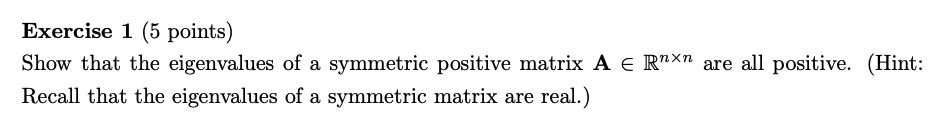

```{r setup, include=FALSE}
knitr::opts_chunk$set(echo = TRUE)
```



If $A$ is a  real n-by-n symmetric matrix, then $A$ = $A^T$.\
Let $\lambda$ be a (real) eigenvalue of $A$ and $V$ be the corresponding real eigenvector. Now, we have:
$$
A V = \lambda V \tag{1.1}
$$

Then we multiply by $V^T$ on both sides ($V^T$ is a transpose of $V$), the following equation would be:\
Note: The outcome of $V^T * V$ would be 1-by-1 vector.
$$
V^TAV = \lambda V^T V  = \lambda ||V||^2\tag{1.2}
$$

Because $A$ is positive definite so the left hand side is positive, and $V$ is a non-zero eigenvector. Also, the length $||V||^2$ must be a positive, we can derive the eigenvalues of a symmetric positive matrix $\lambda$ is positive. It follows that every eigenvalue $\lambda$ of $A$ is real.
$$
\lambda = \frac{V^TAV}{||V||^2} > 0\tag{1.3}
$$


We know that $\lambda$ is a eigenvalue of $A$, and $V$ is a corresponding real eigenvector. To be precise, $A$ is a n-by-n matrix, $V$ is a non-zero n-by-1 vector, and $\lambda$ is a scalar (real or complex number).

$$ 
A V = \lambda V \tag{3.1}
$$

Let's use $A^TA$ be a matrix as a whole to replace $A$, the equation would be:
$$
A^T A V = \lambda V \tag{3.2}
$$

Then, we multiply by $A$ on both sides, the equation would be:

$$
A A^T A V = \lambda A V \tag{3.3}
$$

Because $A$ is a n-by-n matrix, $V$ is a non-zero n-by-1 vector so the result of $A*V$ is a n-by-1 value. In equation 3.2, $A^T A V$ is equal to $\lambda V$; In equation 3.3, $A A^T A V$ is equal to $\lambda A V$. Therefore, we can find out there is a same eigenvalue $\lambda$ between $A^T A$ and $A A^T$.


# References
- https://yutsumura.com/positive-definite-real-symmetric-matrix-and-its-eigenvalues/
- https://lpsa.swarthmore.edu/MtrxVibe/EigMat/MatrixEigen.html
- https://www.wikihow.com/Find-Eigenvalues-and-Eigenvectors


